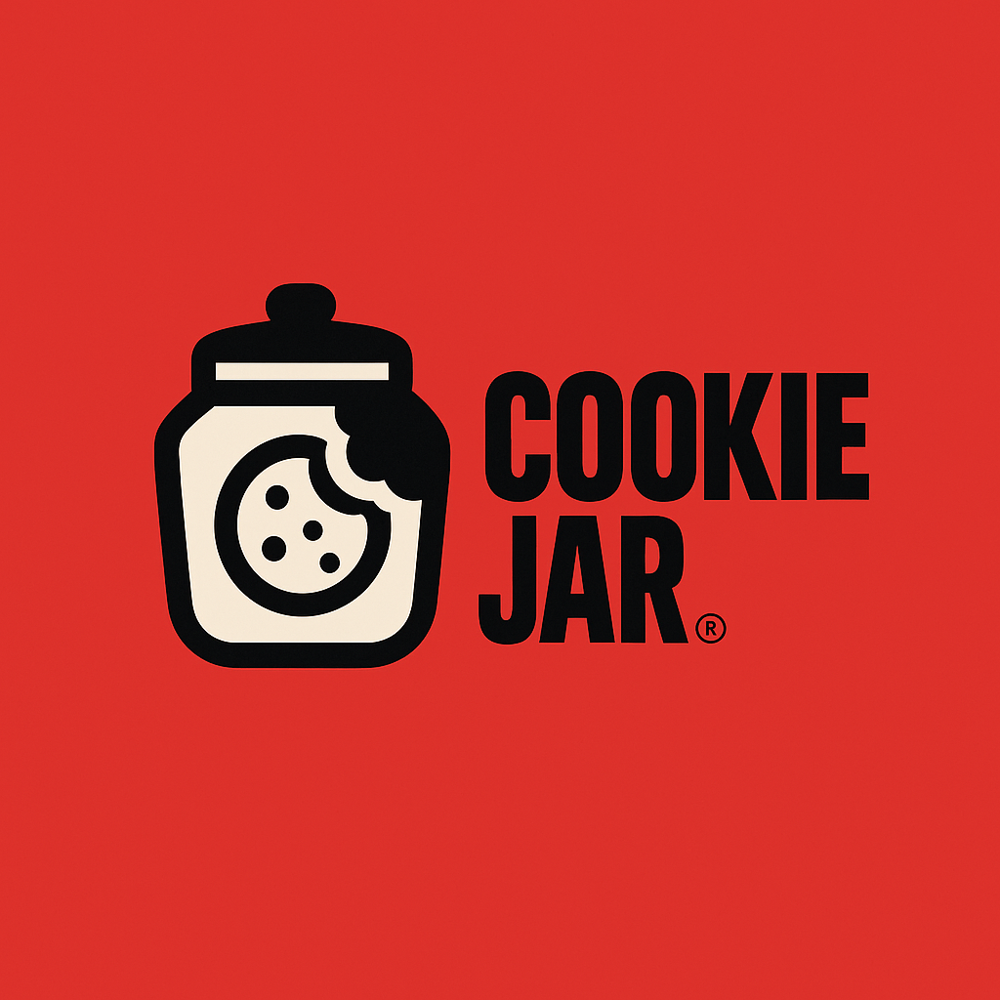

# 🍪 CookieJar

<p align="center">
  
</p>

**Securely sync your cookies across browsers using GitHub Gist.**

CookieJar is a privacy-focused Chrome extension that lets you pick which domains’ cookies to sync between browsers. It uses **GitHub Gist** as encrypted cloud storage — no custom servers, no third-party trackers. Your cookies are encrypted **before** they leave your machine using AES-256-GCM, with a key derived from your passphrase.

---

## ✨ Features

* 🔄 **Cross-browser sync** — share cookies between Chrome instances (other browsers coming soon).
* 🔐 **End-to-end encryption** — AES-256-GCM + PBKDF2/Argon2 key derivation.
* 🎯 **Domain-level selection** — choose exactly which sites to sync.
* ☁️ **Zero backend** — only uses your GitHub Gist as storage.
* 🛡 **Personal control** — requires *your* GitHub Personal Access Token (PAT).

---

## 📦 How It Works

1. **Select domains** — choose which sites’ cookies you want to sync.
2. **Encrypt** — CookieJar encrypts cookies locally with your passphrase.
3. **Push to Gist** — encrypted data is stored in your private GitHub Gist using your PAT.
4. **Pull & decrypt** — on another browser, pull the data and decrypt it with the same passphrase.

---

## 🚀 Installation

1. **Download / Clone** this repo.
2. Go to `chrome://extensions` in Chrome.
3. Enable **Developer Mode** (top-right).
4. Click **Load unpacked** and select the project folder.

---

## ⚙️ Setup

1. **Create a GitHub Personal Access Token (PAT)**

   * Go to [GitHub → Settings → Developer settings → Personal access tokens → Tokens (classic)](https://github.com/settings/tokens)
   * Click **Generate new token**
   * Give it the `gist` scope only (read & write).
   * Save the token — you’ll need it in the extension.

2. **Choose a secure passphrase**

   * Used to derive the encryption key (not stored anywhere).
   * Must be the same on all devices you sync with.

3. **Configure CookieJar**

   * Click the extension icon in Chrome.
   * Enter your PAT and passphrase.
   * Select domains to sync.

---

## 🖥 Usage

* **Push (Upload)**: Saves current cookies for selected domains to your Gist.
* **Pull (Download)**: Retrieves and decrypts cookies from your Gist into the browser.

---

## 🔒 Security Notes

* **Encryption**: AES-256-GCM with PBKDF2/Argon2 key derivation.
* **Storage**: Only encrypted blobs are stored in your private Gist.
* **Trust model**: GitHub cannot read your cookies — only you have the passphrase.
* **Best practice**: Use a long, unique passphrase; treat your PAT like a password.

---

## 📋 Roadmap

* [x] Automatic periodic sync (default 15 mins)
* [x] Automatic sync when cookies changed 
* [ ] Support for Firefox & Edge

---

## 🤝 Contributing

1. Fork the repo
2. Create a feature branch:

   ```bash
   git checkout -b feature/my-feature
   ```
3. Commit your changes
4. Push to your branch and open a Pull Request

---

## 📜 License

MIT License — see [LICENSE](./LICENSE) for details.
